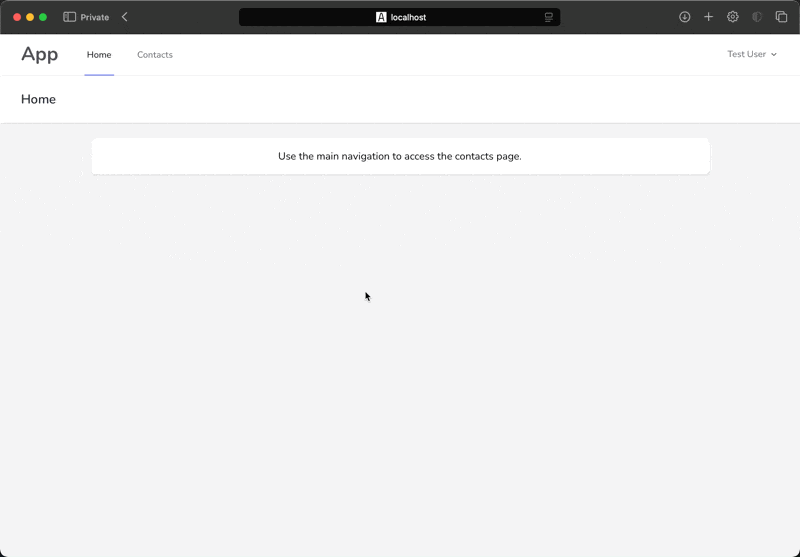

# Laravel + React Contacts CRUD Demo Application

This is a demo application that demonstrates how to build a full-stack web application using Laravel and React.

## Features

- Create, read, update, and delete contacts
- Contact changes are logged in the database
- Real-Time Contact List updates via WebSockets
- Auth, Registration, Password Reset, App Layout were not in scope for this demo so they were added from [Laravel Breeze](https://laravel.com/docs/11.x/starter-kits#breeze-and-next) starter kit
- For the backend application structure, I didn't follow any specific approach to decouple logic from the controllers, I just tried to keep it simple and clean and show the main features of Laravel



## Technologies

- Laravel 11
- React 18
- Next.js 14
- Tailwind CSS 3

## Prerequisites

- PHP 8.3 or later
- Composer 2 or later
- Docker and Docker Compose to run via Laravel Sail

## Directory Structure

The project consists of two separate applications: the Laravel API and the React frontend. The Laravel API is located in the root directory, and the React frontend is located in the `frontend` directory.

## To Run the Application Locally

I recommend using Laravel Sail, because it already have all the infrastructure needed to run the application locally:

- Workspace container with PHP, Composer, Node.js, NPM, and other tools
- MySQL database container
- [Soketi](https://soketi.app/) container to service Real-Time updates via WebSockets

### Backend

Prepare configuration files:

```bash
cp .env.example .env
```

Install PHP dependencies:

```bash
composer install
```

Note: If you have running outdated PHP version locally, you can add `--ignore-platform-reqs` flag to the command above. Once you have the dependencies loaded I recommend to run everything inside the container.

Run the application containers using Laravel Sail:

```bash
./vendor/bin/sail up -d
```

Generate application key:

```bash
./vendor/bin/sail artisan key:generate
```

Run DB migrations and seed the database:

```bash
./vendor/bin/sail artisan migrate
./vendor/bin/sail artisan db:seed
```

To shut down, run:

```bash
./vendor/bin/sail down
```

In order to support Real-Time updates, we need to start and keep jobs worker running:

```bash
./vendor/bin/sail artisan queue:work
```

### Frontend

To make sure you have the same environment I recommend to run frontend in the container as well.
But to be able to run it via sail shortcut command you will need to add the argument for the NPM: `--prefix ./frontend`.

For example to install NPM dependencies:

```bash
./vendor/bin/sail npm --prefix ./frontend install
```

Then to run development server:

```bash
./vendor/bin/sail npm --prefix ./frontend run dev
```

### Access the Application

By default the application will be available at [http://localhost:3000](http://localhost:3000).
And the Backend API is at [http://localhost:8000](http://localhost:8000).
All the configurations can be changed in the `.env` and `frontend/.env.local` files.

If you were seeding the database, you can log in with the following credentials:
login: `test@example.com`
password: `password`

### Running Tests

To run the tests for API, you can use the following commands:

```bash
./vendor/bin/sail pest
```
